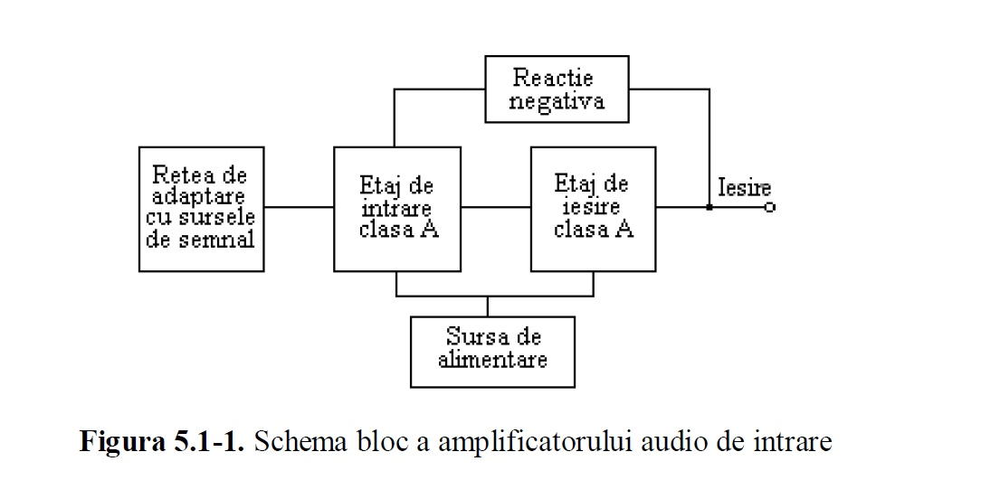
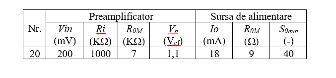

# ElectronicDevices-Circuits
Design of an Audio Pre-amplifier using OrCAD Capture (Schematics &amp; Simulations) and OrCAD PCB Designer

The design project refers to an input audio frequency pre-amplifier with the following block scheme: 

The Audio Pre-amplifier consists of an input adapting network with the main sources of audio signal (eg: microphone, magnetic pickup, ceramic dose pickup, radio, tape recorder, or other signal outputs of electronic audio devices) and two stages of amplification in class A, respectively the input stage and the output stage that performs the signal amplification in the voltage.

Input data sets for this project:

